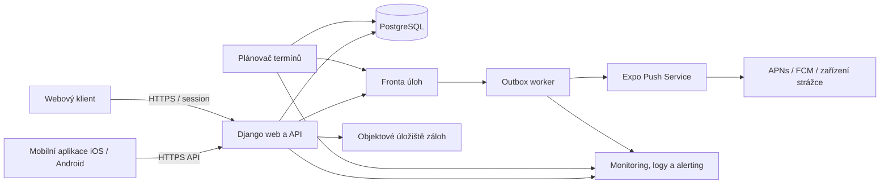
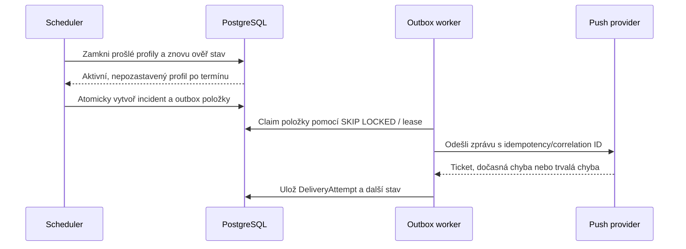

# Architektura služby Hlásím se

## Účel a hranice systému

Hlásím se je bezplatná služba pro pravidelné check-iny. Uživatel nastaví profil, interval a strážce. Pokud serverem potvrzený check-in nepřijde do termínu, systém vytvoří incident a pokusí se upozornit strážce push notifikací.

Služba není tísňová linka, profesionální dohled ani náhrada za 112 nebo 155. Push notifikace jsou best-effort kanál: server může doložit předání poskytovateli, nikoli zobrazení na zařízení nebo reakci strážce. Tato omezení musí být viditelná při onboardingu, nastavení strážce, v právních textech a na webu.

## Architektonické principy

1. **Server je jediná autorita.** Čas serveru určuje přijetí check-inu, další termín, stav pauzy i vznik a ukončení incidentu.
2. **Offline akce není check-in.** Bez potvrzení API jde pouze o čekající požadavek v zařízení. Nesmí posunout serverový termín ani být zobrazena jako potvrzené „jsem v pořádku“.
3. **Bezpečnostní přechody jsou atomické a idempotentní.** Check-in, vznik incidentu a vytvoření outbox položek nesmí zůstat v napůl dokončeném stavu.
4. **Incident je záznam, doručení je samostatný proces.** Selhání push poskytovatele nesmí ztratit incident ani možnost opakovat odeslání.
5. **Citlivá data jsou dostupná jen v minimálním rozsahu.** Poloha je volitelná a strážce ji smí načíst pouze během aktivního incidentu.
6. **Žádný komerční tier.** Všechny podporované funkce jsou zdarma; v systému nejsou paywally, nákupní SDK ani premium autorizace.

## Kontext systému

### Odpovědnosti komponent

- **Mobilní aplikace:** autentizace, správa profilů a strážců, zobrazení autoritativního stavu serveru, volitelný sběr polohy při check-inu, lokální připomínky a transparentní fronta offline požadavků.
- **Django web/API:** pravidla přístupu, validace limitů, serverově autoritativní check-in, správa incidentů, webové rozhraní, auditní záznamy a GDPR operace.
- **PostgreSQL:** transakční zdroj pravdy pro účty, profily, vztahy, check-iny, incidenty, outbox a pokusy o doručení.
- **Plánovač termínů:** pravidelně a opakovatelně vyhledává prošlé aktivní profily; nespoléhá na běžící mobilní aplikaci.
- **Outbox worker:** doručuje notifikace, zaznamenává každý pokus, používá backoff a bezpečně zpracovává duplicity.
- **Monitoring:** měří úplnost generování incidentů, stáří outboxu, chyby API a stav záloh. Produkční alerty musí směřovat alespoň dvěma nezávislými kanály provozovateli.

Konkrétní fronta nebo scheduler mohou být nahrazeny, pokud zůstanou zachované transakční a observační vlastnosti. Bez perzistentního outboxu není systém způsobilý k veřejnému vydání.

## Doménový model

| Entita | Význam a minimální invarianty |
|---|---|
| `User` | Účet a právní identity; e-mail je normalizovaný a unikátní. |
| `CheckInProfile` | Hlásící se profil, vlastník, interval 60–10 080 minut, stav aktivní/pozastavený a autoritativní `next_deadline_at`. Nejvýše 5 profilů na účet. |
| `GuardianInvite` | Časově omezená pozvánka; vztah nevzniká bez přijetí pozvaným uživatelem. |
| `GuardianMembership` | Přijatý vztah strážce k profilu. Nejvýše 5 aktivních strážců na profil. |
| `CheckIn` | Neměnný záznam s `accepted_at` z času serveru, idempotency key a volitelnou polohou. Klientský čas je pouze diagnostická metadata. |
| `Incident` | Jeden aktivní incident na profil a deadline cyklus; obsahuje důvod, deadline, čas vzniku a způsob vyřešení. |
| `NotificationOutbox` | Jedna zamýšlená zpráva konkrétnímu strážci/zařízení; vzniká ve stejné transakci jako incident. |
| `DeliveryAttempt` | Neměnný pokus o odeslání s časem, poskytovatelem, kategorizovanou odpovědí a korelačním ID bez citlivého payloadu. |
| `PushDevice` | Token zařízení, platforma, poslední ověření a stav platnosti; token je tajný údaj. |
| `AuditEvent` | Bezpečnostní a administrativní změny bez hesel, tokenů a přesných souřadnic. |

Databázové constrainty musí vynutit unikátnost aktivního incidentu, idempotency key check-inu, limitní pravidla odolná vůči souběhu a konzistentní cizí klíče. Pouhá kontrola v UI nestačí.

## Kritické přechody

### Online check-in

1. Klient odešle profil, jedinečný idempotency key a případně uživatelem povolenou polohu.
2. API ověří vlastnictví, aktivní stav, interval a oprávnění.
3. V jedné databázové transakci vloží `CheckIn`, nastaví `accepted_at` podle serveru a vypočte `next_deadline_at = accepted_at + interval`.
4. Pokud existuje aktivní incident, přechod ho označí jako vyřešený check-inem a vytvoří outbox zprávu o vyřešení pro dotčené strážce. Incident se nemaže.
5. API vrátí potvrzený čas, nový termín a stabilní ID check-inu. Teprve tato odpověď dovoluje klientovi zobrazit potvrzený úspěch.

Opakování stejného idempotency key vrátí původní výsledek bez druhého check-inu a bez dalšího posunu termínu.

### Offline požadavek

1. Klient požadavek lokálně uloží s idempotency key a zřetelným stavem „čeká na připojení“.
2. Lokální fronta nesmí měnit autoritativní termín ani vytvářet dojem potvrzeného bezpečí.
3. Po obnovení spojení se požadavek odešle. Termín se počítá až od serverového `accepted_at`; požadavek nelze zpětně datovat a zrušit tak již vzniklý incident.
4. Zamítnutý nebo expirovaný požadavek zůstane uživateli viditelný s konkrétní možností opakování nebo odstranění.

### Vznik incidentu a doručení

- Scheduler musí zpracování bezpečně opakovat; unikátní constraint zabrání dvojímu incidentu.
- Push payload neobsahuje souřadnice ani jiné citlivé údaje na zamčené obrazovce. Obsahuje pouze opaque deep link na autorizovaný detail.
- Dočasné chyby se opakují s exponenciálním backoffem a jitterem. Trvalé chyby invalidují token. Po vyčerpání pokusů přejde položka do dead-letter stavu a spustí provozní alarm.
- „Accepted by provider“ není „delivered to device“. UI i telemetrie tyto stavy rozlišují.

### Pauza

Pauza je serverový stav profilu. Po aktivaci scheduler nesmí vytvořit nové incidenty; již aktivní incident pauza automaticky neukončí. Obnovení nastaví nový termín na `server_now + interval` a nikdy nevytvoří incident zpětně za dobu pauzy. Všechny přechody jsou auditované.

## Autorizační a privacy hranice

- Vlastník spravuje své profily, check-iny a strážce. Jeden účet může vlastnit nejvýše 5 profilů.
- Strážce získá přístup až po přijetí pozvánky a může ho kdykoli zrušit.
- Strážce vidí provozní stav hlídaného profilu a aktivní incident. Historii a statistiky vlastníka nevidí, pokud budoucí samostatný souhlas výslovně nerozšíří kontrakt.
- Přesná poloha je volitelná. Strážce ji může načíst pouze u aktivního incidentu, pouze jako poslední polohu z potvrzeného check-inu a vždy s časem a dostupnou přesností. Po vyřešení incidentu endpoint vrací `404` nebo `403` a nesmí data držet v klientské cache.
- Poloha se neposílá v push payloadu, logu, analytice ani crash reportu.
- Přístup k incidentu a poloze se autorizuje na každý request; znalost ID není oprávnění.

## Provozní cíle a měření

SLO se vyhodnocují po klouzavých 30 dnech; plánovaná údržba se započítává, protože uživatelé na ni nemohou bezpečně spoléhat.

| SLI | Produkční SLO | Poznámka |
|---|---:|---|
| Úspěšnost autoritativního check-in API | 99,95 % | 2xx/validní požadavky; p95 do 1 s. |
| Úplnost incidentů | 100 % | Každý způsobilý prošlý deadline má právě jeden incident; denní reconciliation. |
| Čas vzniku incidentu | 99,9 % do 2 minut od deadline | p100 se sleduje a každá mezera je incident. |
| Vytvoření outboxu | 100 % ve stejné transakci | Nesmí existovat incident bez položek pro tehdejší strážce. |
| První pokus push odeslání | 99,9 % do 3 minut od deadline | Měří interní pokus, ne doručení telefonu. |
| Čerstvost backupu | 100 % do 24 hodin | WAL/PITR podle zvoleného hostingu; denní alarm. |

Tyto cíle nejsou marketingovou garancí doručení. Překročení error budgetu zastavuje feature releasy, dokud není spolehlivost obnovena a příčina uzavřena.

## Observabilita

Povinné metriky: počet způsobilých deadline, vytvořených a duplicitně potlačených incidentů, nejstarší nezpracovaný deadline, stáří outboxu, pokusy podle výsledku, invalidní tokeny, check-in latence/chybovost, drift času, stav workerů, úspěch záloh a poslední test obnovy.

Strukturované logy používají correlation ID, ale neobsahují e-mail, push token, heslo, session, souřadnice ani kompletní push payload. Auditní stopa musí rozlišit uživatelskou akci, automat a administrátora.

## Odolnost, zálohy a obnova

- Šifrované databázové zálohy a PITR jsou oddělené od produkčních přístupových údajů.
- Cíl obnovy: **RPO nejvýše 15 minut, RTO nejvýše 4 hodiny**. Pokud hosting tyto cíle neumí doložit a nacvičit, release je blokován.
- Obnova se nejméně čtvrtletně provede do izolovaného prostředí a ověří se referenční integrita, počty kritických tabulek, přihlášení testovacího účtu a reconciliation incidentů.
- Replika ani snapshot nejsou záloha bez ověřené obnovy.

## GDPR a bezpečnost

Před produkčním zpracováním je povinná DPIA zaměřená na bezpečnostní monitoring, polohu, zranitelné osoby, automatické vyhodnocení deadline a dopad nedoručení. Musí existovat aktuální záznam činností zpracování, právní titul, retenční plán, DPA se všemi zpracovateli, proces incident response a proces žádostí subjektů údajů.

Účet musí podporovat export, opravu a odstranění. Mazání nesmí tiše zničit aktivní bezpečnostní vztah: pokud některý profil vlastněný účtem má otevřený incident, výmaz se zablokuje, dokud jej potvrzený check-in bezpečně nevyřeší. Uživatel dostane srozumitelné vysvětlení dopadu; při následném výmazu skončí jeho profily a guardian vztahy, zatímco identita smazaného příjemce u incidentů jiných vlastníků se anonymizuje bez změny jejich bezpečnostního stavu. Retence check-inů, incidentů, auditů a záloh musí být právně schválená a technicky vynucená.

## Nasazení a rollback

- Databázové migrace používají expand/contract a jsou zpětně kompatibilní alespoň s aktuální a předchozí podporovanou verzí klienta.
- Scheduler a outbox worker mají samostatné kill switche. Vypnutí odesílání nezastaví perzistenci incidentů.
- Release je postupný, s canary prostředím a syntetickým profilem s krátkým testovacím termínem mimo produkční uživatelská data.
- Rollback aplikace nesmí vrátit databázi destruktivní migrací. Před aktivací nového deadline evaluatoru musí být ověřen jediný aktivní vlastník plánování.
- Postup migrace ze Supabase je v [migration/supabase-cutover.md](migration/supabase-cutover.md), provozní reakce v [runbooks/alert-delivery.md](runbooks/alert-delivery.md).
